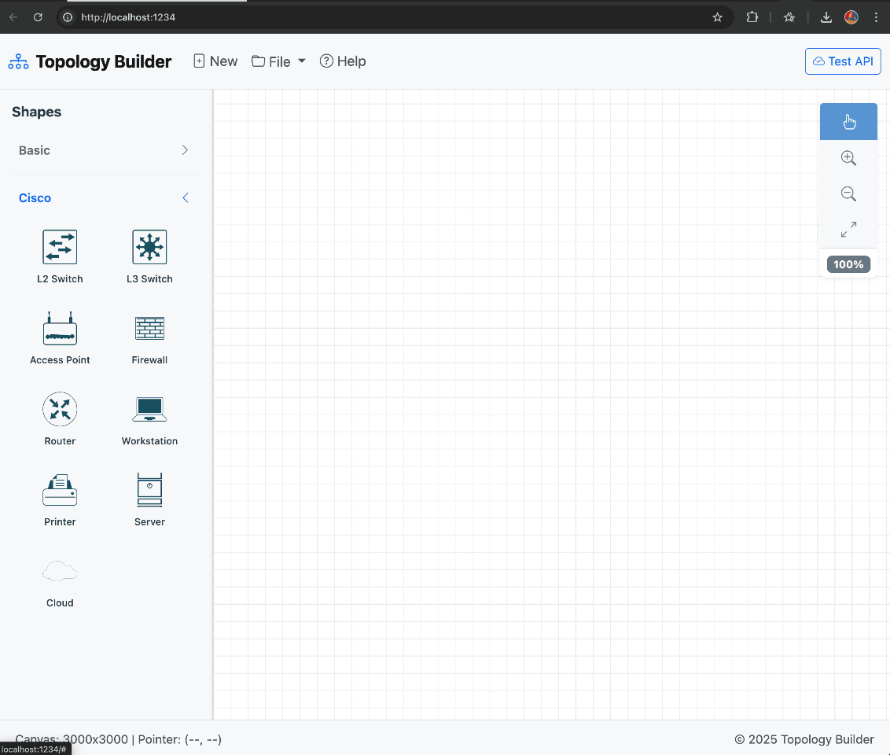

# Topology Builder

[](https://opensource.org/licenses/MIT)
[](https://github.com/bvandewe/topolizer/releases)
[](https://github.com/bvandewe/topolizer/pkgs/container/topolizer)
[](https://github.com/bvandewe/topolizer/actions/workflows/docker-build-publish.yml)
[](https://bvandewe.github.io/topolizer/)
[](https://github.com/psf/black)
[](https://github.com/pre-commit/pre-commit)
[](https://developer.mozilla.org/en-US/docs/Web/JavaScript)
[](https://www.python.org/)

A modern, interactive web-based network topology diagram builder with an intuitive drag-and-drop interface. Built with vanilla JavaScript, SASS, and FastAPI.

**[🚀 Try the Live Demo](https://bvandewe.github.io/topolizer/)**



## ✨ Features

### 🎨 Interactive Canvas

- **Infinite Canvas** with grid background and visual guides
- **Zoom Support** (25% to 400%) for detailed work
- **Pan/Scroll Navigation** for exploring large topologies
- **Grid Snapping** for precise shape placement

### 🔧 Shape Management

- **Multiple Shape Types**:
  - Basic shapes (circle, rectangle, ellipse)
  - Cisco network devices (L2/L3 switches, routers, firewalls, access points, workstations, servers)
- **Drag-and-Drop** shape creation from sidebar
- **Visual Selection** with interaction circles
- **Resize Handles** for shape modification
- **Dynamic Interaction Circle** that scales with shape size
- **Shape Labeling** with customizable:
  - Text content
  - Font size and color
  - Position (above, below, left, right, center)
- **Label Persistence** - Labels automatically move with shapes during drag operations
- **Keyboard Support** - Delete/Backspace key to remove selected shapes

### 🔗 Connection System

- **Visual Connections** between shapes with smart routing
- **Connection Labels** (source, target, and center)
- **Draggable Labels** with circular constraint around shapes
- **Line Styles** (solid, dashed, dotted)
- **Connection Details Modal** for editing properties
- **Automatic Updates** when shapes move

### 💾 Data Persistence

- **Auto-save** to browser localStorage
- **Export/Import** topology as JSON
- **State Preservation** including:
  - Shape positions and sizes
  - Connection labels and styles
  - Zoom level and scroll position
  - Label positions and constraint metadata

### ⌨️ User Experience

- **Keyboard Shortcuts**:
  - `Enter` - Submit modal forms
  - `Escape` - Close modals
  - `Delete` / `Backspace` - Delete selected shape (with associated label and connections)
- **Auto-focus** on input fields
- **Visual Feedback** for all interactions
- **Responsive Design** with Bootstrap 5.3
- **Clean, Modern UI**

## 🚀 Quick Start

### Prerequisites

- **Node.js** 18+ (for frontend)
- **Python** 3.10+ (for backend)
- **Poetry** (Python dependency management)

### Installation

1. **Clone the repository**

   ```bash
   git clone <repository-url>
   cd ToplogyBuilder
   ```

2. **Backend Setup**

   ```bash
   # Install Poetry if not already installed
   curl -sSL https://install.python-poetry.org | python3 -

   # Install Python dependencies
   poetry install
   ```

3. **Frontend Setup**

   ```bash
   cd frontend
   npm install
   cd ..
   ```

### Running the Application

**Option 1: Integrated Server (Recommended)**

```bash
# From project root
./start-server.sh
```

This builds the frontend and starts the backend server with the application at:
`http://localhost:8000`

**Option 2: Separate Processes (Development)**

Terminal 1 - Frontend build watch:

```bash
cd frontend
npm run watch
```

Terminal 2 - Backend server:

```bash
cd backend
poetry run python main.py
```

Access the application at: `http://localhost:8000`

**Option 3: Frontend Only (for frontend development)**

```bash
cd frontend
npm run dev
```

Frontend dev server at: `http://localhost:1234`
(Note: API features will require the backend to be running separately)

**Option 4: Offline/Standalone Mode**

For environments without internet access or server requirements, you can use the standalone static build:

```bash
# Build the standalone package
./build-offline-package.sh

# Extract and open the generated zip file
unzip topology-builder-offline-v*.zip
cd topology-builder-offline
open index.html  # macOS
# or double-click index.html in file explorer
```

This creates a fully self-contained version that runs entirely in the browser with no server needed. All data is stored in browser localStorage. Perfect for:

- Air-gapped environments
- Quick demos without server setup
- Offline usage
- Distribution to users without technical setup

**Note**: The offline version has limited backend features but provides full diagram editing, export/import, and localStorage persistence.

## 📁 Project Structure

```text
ToplogyBuilder/
├── frontend/                  # Frontend application
│   ├── src/
│   │   ├── templates/        # Jinja2 templates
│   │   │   ├── index.jinja   # Main template
│   │   │   └── partials/     # Template components
│   │   ├── index.html        # Generated HTML (from templates)
│   │   ├── js/               # JavaScript modules
│   │   │   ├── app.js        # Application entry point
│   │   │   ├── canvas/       # Canvas event handlers
│   │   │   ├── config/       # Configuration and constants
│   │   │   ├── connections/  # Connection management
│   │   │   ├── services/     # Storage and restore services
│   │   │   ├── shapes/       # Shape factory and events
│   │   │   ├── state/        # Application state
│   │   │   ├── topology/     # File operations
│   │   │   ├── ui/           # UI components and overlays
│   │   │   └── utils/        # Utility functions
│   │   └── styles/           # SCSS styles
│   ├── dist/                 # Production build output
│   ├── build-template.js     # Template rendering script
│   └── package.json          # Frontend dependencies
├── backend/                   # FastAPI backend
│   ├── main.py               # API entry point
│   └── requirements.txt      # Python dependencies
├── docs/                      # Documentation
│   ├── FRONTEND_ARCHITECTURE.md  # Frontend architecture guide
│   ├── VSCODE_SETUP.md       # VS Code setup guide
│   └── PRE_COMMIT_SETUP.md   # Pre-commit hooks guide
├── .vscode/                   # VS Code configuration
│   ├── settings.json         # Editor settings
│   └── extensions.json       # Recommended extensions
├── .pre-commit-config.yaml   # Pre-commit hooks configuration
├── CHANGELOG.md              # Version history
├── LICENSE                   # MIT License
├── README.md                 # This file
└── pyproject.toml            # Poetry configuration
```

## 🎮 Usage

### Creating Shapes

1. Click any shape button in the left sidebar
2. Click on the canvas to place the shape
3. Use the interaction circle to:
   - **Left half**: Edit label and styling
   - **Right half**: Create connection from this shape
4. Drag shapes to reposition them (labels move automatically)
5. Delete shapes with `Delete` or `Backspace` key

### Editing Shape Labels

1. Select a shape (click on it)
2. Click the edit icon (left half of interaction circle)
3. In the Shape Label panel, customize:
   - **Label Text**: Enter text to display
   - **Label Position**: Choose above, below, left, right, or center
   - **Font Size**: Adjust text size
   - **Label Color**: Pick text color
4. Labels automatically stay attached during shape movement

### Creating Connections

1. Click the "Add Connection" button
2. Click the source shape
3. Click the target shape
4. Connection appears with source and target labels

### Editing Labels

- **Shape Labels**: Click the edit icon in the interaction circle or select the shape
- **Connection Labels**: Click the connection to open the Connection Details modal
- **Dragging Labels**: Click and drag connection labels along their constraint circle

### Managing Topology

- **Save**: Automatically saved to browser localStorage
- **Export**: Click "Export Topology" to download as JSON
- **Import**: Click "Import Topology" to load from JSON file
- **Clear**: Click "Clear Topology" to start fresh (after confirmation)

### Zoom and Pan

- **Zoom**: Use the zoom controls in the toolbar (25% to 400%)
- **Pan**: Click and drag on empty canvas space
- **Scroll**: Use mouse wheel or trackpad to scroll

## 🔧 API Endpoints

### Backend API

- `GET /` - Root endpoint
- `GET /api/health` - Health check endpoint
- `GET /api/nodes` - Get all nodes
- `POST /api/nodes` - Create a new node

_Note: The current frontend uses localStorage for persistence. API integration is available for future enhancements._

## 🛠️ Development

### Code Formatting

This project uses automatic code formatting:

- **Python**: Black formatter
- **JavaScript/HTML/CSS**: Prettier
- **Markdown**: markdownlint

See [docs/VSCODE_SETUP.md](docs/VSCODE_SETUP.md) for VS Code configuration.

### Pre-commit Hooks

Run before each commit to ensure code quality:

```bash
# Install pre-commit hooks
poetry run pre-commit install

# Run manually
poetry run pre-commit run --all-files
```

### Project Scripts

```bash
# Start frontend development server
./start-frontend.sh

# Start backend server
./start-backend.sh

# Run both simultaneously (in separate terminals)
```

## 🏗️ Architecture

### Frontend

- **Modular Templates**: Jinja2 templates with reusable partials
- **Build System**: Parcel bundler with asset optimization
- **Styling**: SCSS with Bootstrap 5.3
- **JavaScript**: ES6 modules with vanilla JavaScript
- **State Management**: Centralized application state

### Backend

- **Framework**: FastAPI for REST APIs
- **Static Files**: Serves frontend build from `/static/`
- **CORS**: Configured for local development

### Template Architecture

The frontend uses a modular Jinja2 template system:

- **Templates**: Organized in `frontend/src/templates/`
- **Partials**: Reusable components (navbar, sidebar, modals, etc.)
- **Build Pipeline**: Templates → HTML → Parcel → Optimized Bundle
- **Server Integration**: Backend serves the built static files

See [docs/FRONTEND_ARCHITECTURE.md](docs/FRONTEND_ARCHITECTURE.md) for detailed information.

## 🔍 Troubleshooting

### Labels Not Showing

If labels don't appear after adding them to shapes:

1. Check browser console for errors
2. Ensure the label text is not empty
3. Try refreshing the page - labels are persisted in localStorage

### Tooltips Not Appearing

If floating button tooltips don't work:

1. Ensure Bootstrap 5.3 is loaded
2. Try rebuilding templates: `cd frontend && npm run render`
3. Check that `window.bootstrap` is available in browser console

### Delete Key Not Working

- On macOS, use `Backspace` key (labeled as Delete on keyboard)
- On Windows/Linux, use `Delete` key
- Ensure a shape is selected (should have blue outline)

### Interaction Circle Issues

If the interaction circle appears multiple times or doesn't show:

1. Refresh the page to clear any stale event listeners
2. Ensure you're clicking on the shape itself, not its label
3. Check that shape has proper `id` attribute

### Pre-commit Hooks

If pre-commit hooks fail:

```bash
# Update hooks
poetry run pre-commit autoupdate

# Run manually to see detailed errors
poetry run pre-commit run --all-files
```

## 🏗️ Building for Production

### Full Build

```bash
# Build frontend and start integrated server
./start-server.sh
```

### Frontend Build Only

```bash
cd frontend
npm run build
```

Built files will be in `frontend/dist/` with:

- Optimized and minified HTML, CSS, JavaScript
- Bundled dependencies
- Hashed filenames for cache busting

### Backend Deployment

The FastAPI backend can be deployed using:

- **Uvicorn**: `uvicorn main:app --host 0.0.0.0 --port 8000`
- **Docker**: Create a Dockerfile based on Python 3.10+
- **Cloud Platforms**: AWS Lambda, Google Cloud Run, Azure Functions

Ensure the `frontend/dist/` directory is deployed alongside the backend.

## 🤝 Contributing

1. Fork the repository
2. Create a feature branch (`git checkout -b feature/amazing-feature`)
3. Commit your changes (`git commit -m 'Add amazing feature'`)
4. Push to the branch (`git push origin feature/amazing-feature`)
5. Open a Pull Request

Please ensure:

- Code is properly formatted (pre-commit hooks will help)
- All tests pass
- Documentation is updated if needed

## 📝 License

This project is licensed under the MIT License - see the [LICENSE](LICENSE) file for details.

## 🙏 Acknowledgments

- Bootstrap 5.3 for UI components
- Cisco network device icons for topology visualization
- FastAPI for the backend framework

## 📞 Support

For issues, questions, or contributions, please open an issue on GitHub.

---

**Built with ❤️ using Vanilla JavaScript, SASS, and FastAPI**
